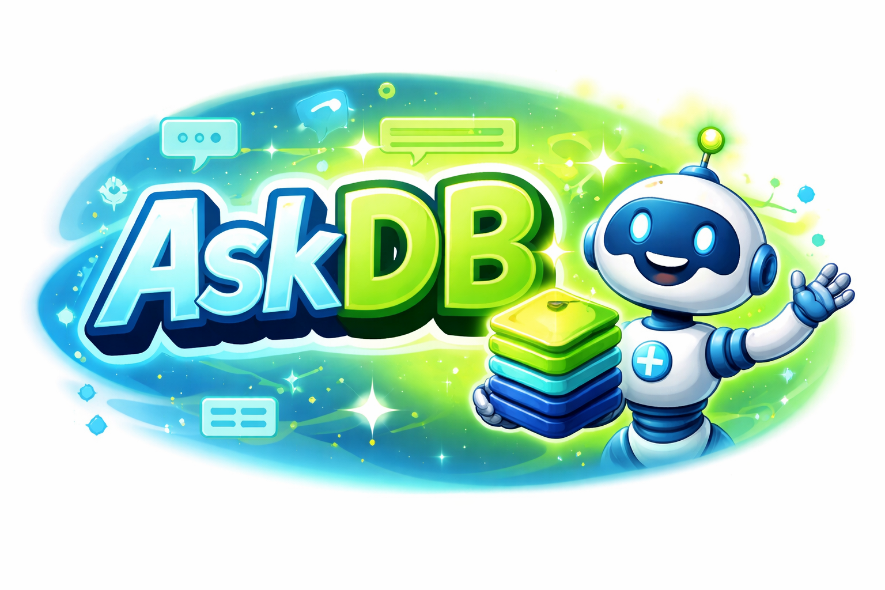

<p align="center">
  <strong>AskDB</strong> &mdash; Give AI agents safe access to your database.
</p>

<p align="center">
  Your database, sandboxed. Your fields, controlled. One MCP endpoint for every AI tool.
</p>

<p align="center">
  
</p>

<p align="center">
  <a href="https://github.com/mgorabbani/askdb/blob/main/LICENSE"></a>
  <a href="https://github.com/mgorabbani/askdb/stargazers"></a>
  <a href="#try-it-locally-with-docker"></a>
  <a href="https://modelcontextprotocol.io"></a>
</p>

<p align="center">
  <a href="#install-on-a-vps-one-command"><strong>Install</strong></a> &middot;
  <a href="#try-it-locally-with-docker"><strong>Try Locally</strong></a> &middot;
  <a href="#how-it-works"><strong>How It Works</strong></a> &middot;
  <a href="#connecting-your-ai-agent"><strong>Connect AI</strong></a> &middot;
  <a href="#security"><strong>Security</strong></a>
</p>

---

## About AskDB

**AskDB** is a self-hosted bridge between your MongoDB database and any AI agent that speaks [MCP](https://modelcontextprotocol.io). It clones your production data into an isolated sandbox, lets you control exactly which fields the AI can see, and exposes a single `/mcp` endpoint that plugs into Claude, ChatGPT, Cursor, and anything else.

No data masking. No fake data. Hidden fields are simply omitted from every response — the AI never knows they exist. Every query is audited.

The product is one dashboard, one `/mcp` URL, one SQLite file of config, and a Docker container per connected database. You self-host it on your own VPS with a single `curl | sudo bash` command; AGPLv3 means you can fork it, run it, and modify it — just share changes if you ship a service built on it.

### Get started in 3 steps

|        | Step        | What happens                                                  |
| ------ | ----------- | ------------------------------------------------------------- |
| **01** | Connect     | Paste your MongoDB connection string in the dashboard         |
| **02** | Configure   | Browse real sample data, toggle which fields the AI can see   |
| **03** | Query       | Give your AI agent `https://<your-domain>/mcp` — done         |

<div align="center">

**Works with** &nbsp;·&nbsp; Claude Desktop &nbsp;·&nbsp; Claude Code &nbsp;·&nbsp; ChatGPT &nbsp;·&nbsp; Cursor &nbsp;·&nbsp; any MCP client

</div>

<br/>

## AskDB is right for you if

- You need **business answers from your database** without writing queries
- You want AI agents to **query real data**, not stale CSV exports
- You refuse to **share raw database credentials** with AI tools
- You need **field-level control** over what AI can see (GDPR, PII, compliance)
- You want **one MCP endpoint** that works across Claude, ChatGPT, and Cursor
- You want **audit logs** for every AI query against your data
- You want to **self-host** everything — your server, your data, your rules

<br/>

## Features

<table>
<tr>
<td align="center" width="33%">
<h3>Sandbox Isolation</h3>
Production data cloned into a Docker container. AI reads the copy, never the original.
</td>
<td align="center" width="33%">
<h3>Field-Level Control</h3>
Toggle any field or collection visible/hidden. Changes take effect immediately &mdash; no re-sync needed.
</td>
<td align="center" width="33%">
<h3>PII Auto-Detection</h3>
Fields like <code>email</code>, <code>password</code>, <code>ssn</code>, <code>phone</code> are detected and pre-hidden automatically.
</td>
</tr>
<tr>
<td align="center">
<h3>MongoDB-Style MCP</h3>
Resources plus tools like <code>list-collections</code>, <code>collection-schema</code>, <code>find</code>, <code>aggregate</code>, <code>count</code>, <code>distinct</code>, <code>sample-documents</code>, <code>execute-typescript</code>, and <code>save-insight</code>.
</td>
<td align="center">
<h3>Query Validation</h3>
Allowlist-only: <code>find</code>, <code>aggregate</code>, <code>count</code>, <code>distinct</code>. Write operations rejected. Dangerous pipeline stages blocked.
</td>
<td align="center">
<h3>Audit Trail</h3>
Every MCP query logged with timestamp, execution time, collection, and document count.
</td>
</tr>
<tr>
<td align="center">
<h3>API Key Auth</h3>
Bearer token authentication. Keys shown once on creation, stored hashed (SHA-256). Revoke anytime.
</td>
<td align="center">
<h3>Agent Memory</h3>
Common query patterns are tracked automatically. Agents learn your database over time.
</td>
<td align="center">
<h3>Schema Cache</h3>
Full schema summary with field types, relationships, and descriptions &mdash; agents understand your data without querying every time.
</td>
</tr>
</table>

<br/>

## Code Mode

The `execute-typescript` MCP tool lets the AI write a small TypeScript program that composes multiple Mongo queries inside a sandboxed [QuickJS](https://bellard.org/quickjs/) WebAssembly isolate. One round trip in, one structured result out &mdash; instead of N+1 separate tool calls.

Why it matters:

- **Math is correct.** Sums, averages, percentages run as actual JavaScript inside the sandbox. The model decides what to compute; the sandbox computes it.
- **Token cost drops.** A query that touches 500 documents lives and dies inside the isolate. Only the final result crosses the wire to the model.
- **Security is unchanged.** Every `external_*` call inside the sandbox routes through the same `executeQueryOperation` that the direct `find`/`aggregate`/`count`/`distinct` tools use. Hidden fields are stripped before data crosses into the sandbox. The isolate has no `fs`, no `process`, no `require`, no `fetch`, no globals at all beyond the four bridge functions.

Example program the model writes:

```ts
const top = await external_find({ collection: "products", limit: 5 });
const ratings = await Promise.all(
  top.map((p) =>
    external_find({ collection: "ratings", filter: { productId: p._id } })
  )
);
return top.map((p, i) => ({
  name: p.name,
  avgRating: ratings[i].reduce((s, r) => s + r.score, 0) / ratings[i].length,
}));
```

Limits per execution: 30s wall-clock timeout, 128MB memory, 50 bridge calls, 256KB serialized result. Disable the tool entirely by adding `execute-typescript` to `ASKDB_MCP_DISABLED_TOOLS`.

<br/>

## Problems AskDB solves

| Without AskDB | With AskDB |
|---|---|
| You share raw MongoDB credentials with AI tools and hope nothing gets written. | Sandbox isolation. AI queries a read-only copy. Production is never touched. |
| You export CSVs to ChatGPT. Data is stale within hours, and you just violated GDPR. | Real-time queries against live sandbox data. Fields with PII are auto-hidden. |
| You set up Metabase/Looker for weeks, and your AI agent still can't use it. | One MCP endpoint. Works with Claude, ChatGPT, Cursor in minutes. |
| Business team asks "how many pro users signed up this week?" and waits for an engineer. | They ask the AI agent directly. It queries AskDB. Answer in seconds. |
| You have no idea what your AI agent queried or when. | Full audit trail. Every query, every timestamp, every result count. |
| You want AI to see `orders` but not `email` or `credit_card` inside orders. | Field-level toggles. Hide specific fields, not entire collections. |

<br/>

## How It Works

```
┌─────────────────────────────────────────────────┐
│                   Your Server                     │
│                                                   │
│  ┌──────────────┐       ┌───────────────┐        │
│  │  Dashboard    │──────>│  SQLite       │        │
│  │  + API + MCP  │       │  (config only) │        │
│  │  :3100        │       └───────────────┘        │
│  └──────────────┘                                 │
│                          ┌───────────────┐        │
│                          │  Sandbox      │<── clone from prod
│                          │  MongoDB      │        │
│                          └───────────────┘        │
└─────────────────────────────────────────────────┘
         ^
         | MCP (Streamable HTTP)
   Claude / ChatGPT / Cursor
```

1. **Connect** &mdash; paste your MongoDB connection string
2. **Clone** &mdash; AskDB runs `mongodump`/`mongorestore` into an isolated Docker container
3. **Configure** &mdash; browse your schema with real sample data, toggle fields visible or hidden
4. **Query** &mdash; give your AI agent the MCP URL &mdash; hidden fields are stripped from every response

The AI never knows hidden fields exist. Hidden collections are excluded from metadata tools and hidden fields are stripped from resources and query results.

<br/>

## What AskDB is not

|                              |                                                                                                |
| ---------------------------- | ---------------------------------------------------------------------------------------------- |
| **Not a database.**          | AskDB stores configs and audit logs. Your data stays in MongoDB.                               |
| **Not a BI tool.**           | No dashboards, no charts. AskDB gives AI agents structured access to your data.                |
| **Not an agent framework.**  | We don't build agents. We give them safe, controlled access to your database.                  |
| **Not a data masking tool.** | No fake data, no tokenization. Hidden fields are simply omitted from responses.                |
| **Not multi-tenant.**        | Single-user, self-hosted. Multi-user and teams are on the roadmap.                             |

<br/>

## Install on a VPS (one command)

On a fresh Ubuntu 22.04+ or Debian 12+ VPS:

    curl -fsSL https://raw.githubusercontent.com/mgorabbani/askdb/main/install.sh | sudo bash

The installer will:
- Install Docker if it's missing (after asking).
- Prompt for your domain and a Let's Encrypt email.
- Generate all secrets automatically.
- Bring up the stack behind Caddy with auto-provisioned HTTPS.

Total time on a fresh VPS is 2–3 minutes.

### Set up your domain

1. In your DNS provider, add an A record pointing to your VPS IP:

       name:   askdb         (or any subdomain)
       value:  <VPS public IP>
       proxy:  **OFF**       — Cloudflare users: grey cloud, not orange.
                               The orange proxy blocks Let's Encrypt HTTP-01.

2. Verify DNS has propagated:

       dig +short askdb.example.com

3. Open ports 80 and 443 on your VPS firewall.
4. Run the installer above.

### Create your admin account

The first time you open `https://<your-domain>`, the dashboard detects the empty database and redirects you to `/setup` to create the admin account. This is the account you'll use to log in and approve the OAuth prompt when you connect Claude or Cursor &mdash; so do this before the next step. After the first signup, further registrations are rejected.

### Connect Claude or Cursor

Paste `https://<your-domain>/mcp` into Claude / Cursor as a custom MCP connector. When prompted, complete the OAuth approval in your browser &mdash; you'll log in with the admin account you just created. No API key is needed for remote clients.

### Alternative install modes

The installer offers three modes:

- **Caddy (default):** auto-provisioned HTTPS. Requires a domain with A record.
- **Proxyless:** you run your own reverse proxy (Coolify, Traefik, nginx). AskDB binds `127.0.0.1:3100`; point your proxy there.
- **Cloudflare Tunnel:** no open ports. Paste your tunnel token when prompted.

### Upgrade

    cd /opt/askdb && sudo bash <(curl -fsSL https://raw.githubusercontent.com/mgorabbani/askdb/main/install.sh)

The installer is idempotent — re-running it against an existing install pulls the latest images and restarts. Secrets, data, and your `.env` are preserved.

### Backups

Your data lives in the `askdb-data` Docker volume (SQLite + generated secrets + encrypted connection strings). Back it up with:

    docker run --rm -v askdb-data:/data alpine tar czf - /data > askdb-backup.tgz

<br/>

## Try it locally with Docker

Want to kick the tires before pointing a domain at a VPS? This runs AskDB on your own machine in a few minutes — no installer, no DNS, no HTTPS. Works on macOS, Linux, or Windows with Docker Desktop.

### Prerequisites

- [Docker Desktop](https://docs.docker.com/desktop/) (macOS / Windows) **or** Docker Engine + Compose plugin (Linux). Verify with:

      docker compose version

### Run

```bash
git clone https://github.com/mgorabbani/askdb.git
cd askdb

# Write a local .env — BETTER_AUTH_URL must match the origin your browser
# uses. TRUSTED_ORIGINS can list both localhost and 127.0.0.1 so either
# URL works in your browser.
cat > .env <<EOF
COMPOSE_PROFILES=proxyless
DOMAIN=localhost
BETTER_AUTH_URL=http://localhost:3100
TRUSTED_ORIGINS=http://localhost:3100,http://127.0.0.1:3100
EOF

# Build + start with the "proxyless" profile — no Caddy, no TLS, binds to 127.0.0.1:3100
docker compose up --build -d

# Wait ~45 seconds for the first build + healthcheck, then:
docker compose ps                   # askdb should show "(healthy)"
open http://localhost:3100          # or visit http://127.0.0.1:3100
```

The dashboard detects the empty database and redirects you to `/setup` to create the first admin. After signup, subsequent registrations are rejected.

Create an admin account in the dashboard, add a database connection, and try the MCP URL at `http://127.0.0.1:3100/mcp` with a local MCP client (Claude Code / Cursor with a fixed bearer token — remote OAuth flows need HTTPS).

### Tail logs

```bash
docker compose logs -f askdb
```

### Stop and clean up

```bash
# Stop containers, keep data
docker compose down

# Stop and wipe everything (DB, secrets, volumes)
docker compose down -v
```

### What this does not test

The local setup deliberately skips the Caddy TLS path and the `install.sh` installer — both require a public domain and a real VPS. Use this to evaluate the product; use `install.sh` on a VPS once you're ready to connect Claude or Cursor over OAuth.

<br/>

## Connecting Your AI Agent

Claude, Cursor, and any other remote-MCP client connect to `https://<your-domain>/mcp`. Paste that URL as a custom connector and complete the OAuth approval in your browser. No port, no path rewriting, no API key.

### API Key Clients

For clients that still expect a fixed bearer token header (e.g. Claude Code or Cursor local configs), create an API key in the dashboard, then add it to your AI tool:

### Claude Desktop / Claude Code

Add to MCP config:

```json
{
  "askdb": {
    "type": "streamable-http",
    "url": "https://YOUR_SERVER/mcp",
    "headers": {
      "Authorization": "Bearer ask_sk_YOUR_KEY"
    }
  }
}
```

### Cursor

```json
{
  "mcpServers": {
    "askdb": {
      "url": "https://YOUR_SERVER/mcp",
      "headers": {
        "Authorization": "Bearer ask_sk_YOUR_KEY"
      }
    }
  }
}
```

<br/>

## FAQ

**How long does setup take?**
Under 10 minutes. Paste your MongoDB URL, configure visibility, copy the MCP URL into your AI tool.

**Does AskDB write to my production database?**
Never. It connects read-only to run `mongodump`, then all queries go against the sandbox copy.

**How is field filtering different from data masking?**
Data masking replaces values with fakes. AskDB simply omits hidden fields entirely &mdash; the AI doesn't know they exist.

**Can I use this with databases other than MongoDB?**
Not yet. PostgreSQL and MySQL adapters are on the roadmap. The adapter interface is ready.

**How does the sandbox stay fresh?**
Manual sync &mdash; click "Sync Now" in the dashboard. Scheduled sync is on the roadmap.

**Is this secure enough for production data?**
AskDB enforces read-only access, field stripping at query time, query validation (allowlist only), encrypted connection strings, and full audit logging. See the [Security](#security) section.

<br/>

## Security

These invariants always hold:

1. **Production databases are never written to** &mdash; read-only connections only
2. **Hidden fields never appear in MCP responses** &mdash; stripped at query time
3. **Hidden collections are never listed or queryable**
4. **All queries are validated** &mdash; only `find`, `aggregate`, `count`, `distinct` allowed
5. **Dangerous aggregation stages are blocked** &mdash; `$merge`, `$out`, `$collStats`, `$currentOp`, `$listSessions`
6. **`$lookup` on hidden collections is rejected**
7. **Connection strings are encrypted at rest** (AES-256-GCM), never logged
8. **API keys are hashed** (SHA-256), shown once, never stored in plaintext
9. **Every MCP query is logged** to the audit trail

> **Docker socket hardening:** the compose file includes a `tecnativa/docker-socket-proxy` sidecar so AskDB never has direct access to `/var/run/docker.sock` — only the containers, images, networks, and volumes endpoints it needs are exposed.

<br/>

## Development

```bash
pnpm dev              # Full dev (API + UI + file watching)
pnpm build            # Build all packages
pnpm typecheck        # Type check all packages
pnpm db:generate      # Generate DB migration
pnpm db:migrate       # Apply migrations

# Tests
pnpm --filter @askdb/mcp-server test    # Unit tests (sandbox isolation, bridge, runtime)
pnpm --filter @askdb/mcp-server e2e     # End-to-end test against real MongoDB (requires Docker)
```

The `e2e` script boots a throwaway MongoDB container, seeds two collections, spins up a temporary AskDB MCP server pointed at a temp SQLite DB, and walks through the full Streamable HTTP transport with the official MCP client. It asserts that hidden fields are stripped before data crosses into the Code Mode sandbox &mdash; the cleanest way to verify nothing has regressed end to end.

### Project Structure

```
askdb/
├── server/              # @askdb/server — Express API + UI host + MCP endpoint
├── ui/                  # @askdb/ui — Vite React SPA
├── cli/                 # @askdb/cli — askdb CLI
├── packages/
│   ├── shared/          # @askdb/shared — DB schema, adapters, crypto
│   └── mcp-server/      # @askdb/mcp-server — MCP logic (mounted into server)
├── scripts/
│   └── dev-runner.ts    # Zero-dep orchestrator: spawns server + UI watcher
├── docker/
│   └── entrypoint.sh    # Runtime entrypoint (single server process under tini)
├── Dockerfile           # Multi-stage: deps → build → runtime
├── docker-compose.yml   # One-command self-host
└── data/                # SQLite database (gitignored, mounted as volume in prod)
```

### Tech Stack

- [Vite](https://vite.dev) + [React](https://react.dev) &mdash; Dashboard UI
- [Express](https://expressjs.com) &mdash; API server
- [Drizzle ORM](https://orm.drizzle.team) &mdash; Database (SQLite)
- [Better Auth](https://better-auth.com) &mdash; Authentication
- [shadcn/ui](https://ui.shadcn.com) &mdash; UI components
- [MCP SDK](https://github.com/modelcontextprotocol/sdk) &mdash; AI agent protocol
- [dockerode](https://github.com/apocas/dockerode) &mdash; Container management

<br/>

## Roadmap

- [x] MongoDB adapter with sandbox isolation
- [x] Field-level visibility toggles
- [x] PII auto-detection
- [x] MCP server with 4 tools
- [x] API key auth + audit logging
- [x] Query validation + pipeline security
- [x] Agent memory (query pattern tracking)
- [x] Schema cache for agent context
- [x] CLI tool
- [x] Code Mode (`execute-typescript` MCP tool with QuickJS-WASM sandbox)
- [ ] PostgreSQL adapter
- [ ] MySQL adapter
- [ ] Multi-user / team management
- [ ] Sync schedules (6h, 12h, daily, weekly)
- [ ] Cloud hosted version
- [ ] Row-level filtering
- [ ] SSO/SAML

<br/>

## Community

- [GitHub Issues](https://github.com/mgorabbani/askdb/issues) &mdash; Bugs and feature requests
- [GitHub Discussions](https://github.com/mgorabbani/askdb/discussions) &mdash; Ideas and RFCs
- [Code of Conduct](CODE_OF_CONDUCT.md) &mdash; Contributor Covenant 2.1
- [Security Policy](SECURITY.md) &mdash; Responsible disclosure (do **not** open public issues for vulnerabilities)
- [Changelog](CHANGELOG.md) &mdash; Release history

<br/>

## Contributing

We welcome contributions. See the [contributing guide](CONTRIBUTING.md) for development setup, project layout, and commit conventions.

<br/>

## License

AskDB is licensed under the [GNU Affero General Public License v3.0 or later](LICENSE).

AGPLv3 means you can self-host, fork, and modify AskDB freely. If you run a modified version as a service accessible to others over a network, you must share your modifications under the same license.

## Star History

[](https://www.star-history.com/?repos=mgorabbani%2Faskdb&type=date&legend=top-left)

<br/>

---

<p align="center">
  <sub>Open source under AGPLv3. Built for people who want AI to understand their data, not own it.</sub>
</p>
